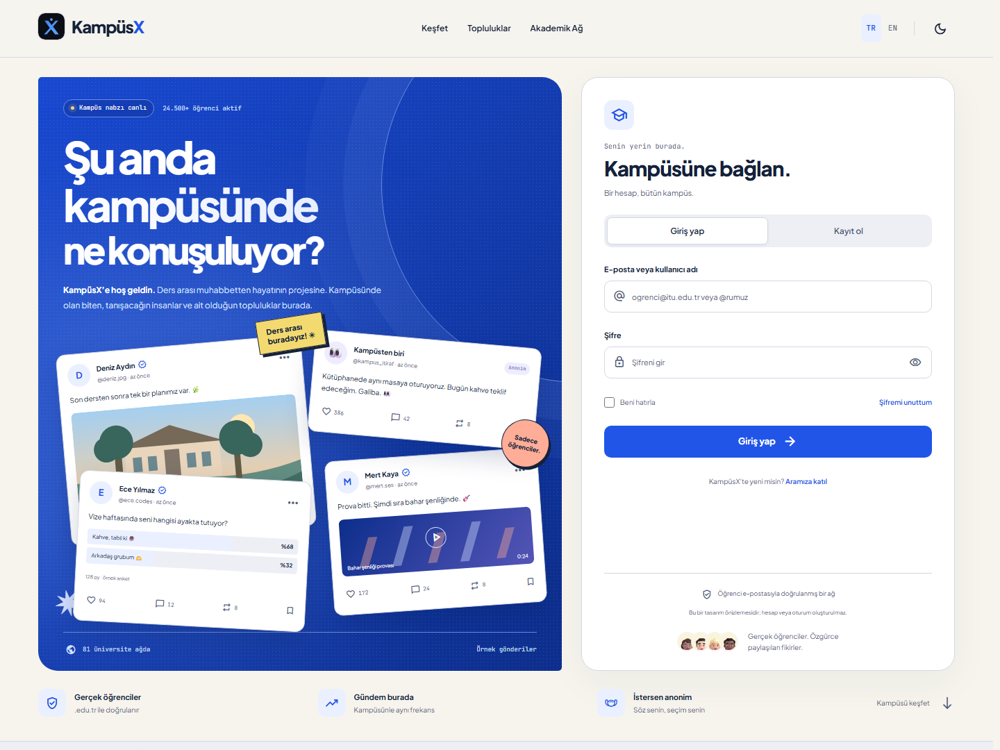

# KampüsX

[Türkçe](#türkçe) | [English](#english)



## Türkçe

Nx 23.2.1 · Angular 22.2.1 · standalone + OnPush · Tailwind CSS 3.4 · Transloco 8.4.

KampüsX, öğrenciler için, öğrenciler tarafından geliştirilen bir kampüs sosyal medya ve mikroblog platformudur. Kampüs hayatını, dersleri, etkinlikleri ve günlük paylaşımları bir araya getirmeyi hedefler.

Bu depo, KampüsX'in welcome ve auth ekranlarının Angular/Nx frontend kaynak kodunu,
ortak UI kütüphanelerini, tasarım token'larını, testlerini ve yayın yapılandırmasını içerir.
Mevcut teslimat frontend kapsamındadır; backend, API ve gerçek kimlik doğrulama sonraki aşamadadır.
Görseller özgün SVG/CSS illüstrasyonlarıdır.

### Canlıya alma

Kaynak dosyaları bu repodan yayın ortamına alınır. Vercel'de bu GitHub reposunu import edin
ve **Root Directory** olarak repo kökünü (`.`) kullanın. Repodaki [vercel.json](vercel.json)
kurulum, derleme, çıktı dizini ve Angular sayfa yönlendirmesini tanımlar.

| Ayar             | Değer                        |
| ---------------- | ---------------------------- |
| Node.js          | 24.x, en az 24.15.0          |
| Install Command  | `npm ci`                     |
| Build Command    | `npm run build`              |
| Output Directory | `dist/apps/shell/browser`    |
| Framework Preset | Other; yapılandırmada `null` |

SPA yönlendirmesi, `/auth/login` gibi adresler doğrudan açıldığında veya yenilendiğinde
uygulamanın yüklenmesini sağlar. Son kullanıcılar yayındaki adresi açar; projeyi kendi
bilgisayarlarında kurmaları gerekmez. Bu commit bir hosting hesabına bağlantı kurmaz;
repo yayına alınacağı Vercel projesine bir kez bağlanmalıdır.

Farklı bir statik sunucuda aynı çıktı dizinini yayınlayın ve uygulama rotalarını
`index.html` dosyasına yönlendirin. `dist` derleme sırasında üretilir; kaynak dosyalarla
birlikte Git'te tutulmaz.

Yapılandırma referansları: [Vercel proje ayarları](https://vercel.com/docs/project-configuration/vercel-json)
ve [Node.js sürümleri](https://vercel.com/docs/functions/runtimes/node-js/node-js-versions).

### Geliştirici ortamı

Node.js **24.15+ (24.x)** kullanın. Aşağıdaki komutlar geliştirme ve doğrulama içindir.

```powershell
git clone https://github.com/Elif-Rvyd/Kamp-sX.git
cd Kamp-sX
npm ci
npx nx serve shell
```

Tarayıcı: <http://localhost:4200>. Nx global kuruluysa `nx serve shell` yeterlidir.

```powershell
npx nx build shell
npm run typecheck
npm test
npm run check:i18n
npm run format:check
npm run test:ui
```

UI testleri ilk kez çalıştırılacaksa `npx playwright install chromium` gerekir.
Test sunucusu 4300 portunda otomatik açılır; 4200 üzerinde çalışan önizlemeyi etkilemez.

### Hazır ekranlar

- `/`: afiş, dört örnek gönderi, auth paneli, trend şeridi, paylaşım özellikleri,
  üç keşfet akışı, örnek istatistikler, sekiz topluluk, akademik ağ, CTA ve footer.
- `/auth/login`, `/auth/register`, `/auth/forgot-password`: lazy loaded auth sayfaları.
- Bilinmeyen adresler: uygulama içinde 404 görünümü.
- Anlık açık/koyu tema ve TR/EN dil değişimi; tercihleri localStorage’da saklar.
- Reactive Forms: zorunlu alanlar, e-posta, `.edu.tr`, kullanıcı adı, şifre uzunluğu,
  koşul onayı; ilk hataya odak, şifre göster/gizle, güç ve loading/success durumları.
- Google düğmesi demo açıklaması gösterir. Şifre sıfırlama görünümü e-posta göndermez.
- Topluluk ve CTA düğmeleri kayıt panelini açar. Yasal bağlantılar önizleme açıklamasını açar.
- Masaüstünde afiş ve auth paneli aynı yüksekliğe hizalanır; mobilde tek sütun kullanılır.
- Gündem şeridi açık/koyu tema renklerini kullanır; Hakkında ve yasal bağlantılar footer'dadır.

`.edu.tr` kontrolü yalnızca adres biçimini doğrular; gerçek öğrenci kimliği doğrulaması yapmaz.
Video kartı statik önizlemedir.

### Mimari

`apps/shell/src/app/features/welcome/sections` içinde hero, about, communities ve CTA;
`features/auth` içinde panel ve ayrı formlar; `layout` içinde header/footer;
`core` içinde tema, dil ve yalnızca iskelet auth guard.

`libs/shared/ui`: atoms → molecules → organisms. Bölümler → sayfalar shell'e aittir.
Ortak component stilleri `libs/shared/ui/styles.css` içindedir; her tüketici uygulama bu dosyayı
design token'lardan sonra bir kez import eder. Shell stylesheet'i sayfa yerleşimini yönetir.
`libs/shared/design-tokens/tokens.css` renk/tema/type değerlerinin tek kaynağıdır;
Tailwind preset bu değişkenleri tüketir. `libs/shared/util` doğrulama, sayı formatlama,
reveal directive ve TypeScript model/örnek verileri içerir.

`assets/i18n/tr.json` ve `en.json` paket içinde yüklenir; dil değiştirmek API isteği oluşturmaz.
Fontlar ve Material Symbols brief doğrultusunda index.html’de Google Fonts üzerinden yüklenir;
ağ bağlantısı yoksa sistem fontları kullanılır. Tailwind yerel derlenir, CDN kullanılmaz.

Tasarım kararları ve token mapping: [DESIGN.md](DESIGN.md). Kullanıcının güncel isteği
ve KampusX-welcome-spec2.md esas alındı. Ayrı HTML referansı bulunmadığından özgün kompozisyon
oluşturuldu; brief'teki logo SVG aynen korundu. Tüm sosyal içerik ve istatistikler örnektir.

### Belgeler ve doğrulama

- [Sistematik proje raporu](docs/PROJE-RAPORU.md)
- [Test kayıtları](docs/qa/verification.md)
- [Koyu tema kayıt görünümü](docs/qa/updated-register-dark.png)

Son doğrulamada üretim derlemesi, typecheck, 3 doğrulama testi ve 23 tarayıcı senaryosu geçti.
220 TR/EN anahtarı eşleşiyor. 1440/768/390/320 px × TR/EN × açık/koyu durumlarında
yatay taşma ve otomatik axe ihlali bulunmadı. Otomatik tarama manuel ekran okuyucu veya
fiziksel cihaz testi yerine geçmez.

### Ürün yol haritası

Repodaki ürün vizyonu; öğrenci profilleri, takip edilenlerin akışı, yazı/fotoğraf/müzik/video
paylaşımı, beğeni/yeniden paylaşım/alıntı/yorum ve gerçek zamanlı mesajlaşmayı kapsar.
Bunlar sonraki geliştirme aşamalarının hedefleridir.

Önceki repo tanıtımında Express.js modüler monolit, Supabase (PostgreSQL/Auth/Storage),
Docker/Docker Compose ve Vercel hedef teknolojiler olarak yer alır. Bu servisler henüz
uygulanmadı; entegrasyon kararları sonraki aşamada netleştirilmelidir.

İlk remote için `mfe-feed` önerilir. Gerçek auth, yasal metinler ve üniversite doğrulaması
ayrı bir uygulama aşamasında tasarlanmalı; mevcut guard güvenlik sınırı değildir.

## English

Nx 23.2.1 · Angular 22.2.1 · standalone + OnPush · Tailwind CSS 3.4 · Transloco 8.4.

KampüsX is a campus social media and microblogging platform built for students, by students.
It aims to bring campus life, classes, events and everyday conversations together in one place.

This repository contains the Angular/Nx frontend source for the welcome and authentication screens,
shared UI libraries, design tokens, tests and deployment configuration. The current delivery covers
the frontend; backend services, APIs and real authentication belong to the next phase.
Visuals are original SVG/CSS illustrations. Social content, communities and statistics are sample data.

### Deployment

Import this GitHub repository into Vercel and use the repository root (`.`) as the **Root Directory**.
The included [vercel.json](vercel.json) defines installation, build, output and Angular route handling.

| Setting          | Value                          |
| ---------------- | ------------------------------ |
| Node.js          | 24.x, at least 24.15.0         |
| Install Command  | `npm ci`                       |
| Build Command    | `npm run build`                |
| Output Directory | `dist/apps/shell/browser`      |
| Framework Preset | Other; `null` in configuration |

The SPA rewrite allows routes such as `/auth/login` to load when opened directly or refreshed.
End users visit the deployed URL and do not need to install the project locally. This commit does
not connect a hosting account; the repository must be linked to its Vercel project once.

For another static host, publish the same output directory and route application paths to
`index.html`. `dist` is generated during the build and is not stored in Git alongside the source.

Configuration references: [Vercel project settings](https://vercel.com/docs/project-configuration/vercel-json)
and [Node.js versions](https://vercel.com/docs/functions/runtimes/node-js/node-js-versions).

### Developer setup

Use Node.js **24.15+ (24.x)**. The following commands are for development and verification.

```sh
git clone https://github.com/Elif-Rvyd/Kamp-sX.git
cd Kamp-sX
npm ci
npx nx serve shell
```

Open [http://localhost:4200](http://localhost:4200). If Nx is installed globally, you can also run `nx serve shell`.

```sh
npx nx build shell
npm run typecheck
npm test
npm run check:i18n
npm run format:check
npm run test:ui
```

Before running UI tests for the first time, install Chromium with `npx playwright install chromium`.
The test server starts automatically on port 4300 and leaves the preview on port 4200 available.

### Implemented screens and features

- `/`: campus poster, four sample posts, auth panel, agenda strip, sharing features, three feed tabs,
  sample statistics, eight communities, academic network, closing CTA and footer.
- `/auth/login`, `/auth/register`, `/auth/forgot-password`: lazy-loaded authentication pages.
- Unknown routes: an in-app 404 screen.
- Instant light/dark and Turkish/English switching; preferences persist in localStorage.
- Reactive Forms: required fields, email and `.edu.tr` checks, username rules, password length and consent;
  first-error focus, password visibility, strength indicator, loading and result states.
- The Google button displays a demo explanation. Password reset does not send emails.
- Community and CTA buttons open sign-up. Legal links open a modal explaining the actual preview behavior.
- Matching poster and auth panel heights on desktop, with a single-column mobile layout.
- A theme-aware campus agenda strip, with About and legal navigation in the footer.

Forms create no real accounts or sessions and send no credentials to a server. The `.edu.tr` check
validates the address format only; it does not verify student identity. The video card is a static preview.

### Architecture

`apps/shell/src/app/features/welcome/sections` owns hero, about, communities and closing CTA;
`features/auth` owns the panel and separate forms; `layout` owns header/footer;
`core` owns theme, language and a placeholder auth guard.

`libs/shared/ui` follows atoms → molecules → organisms. Sections and pages belong to shell.
Shared component styles live in `libs/shared/ui/styles.css`; consuming apps import them once alongside
the design tokens. The shell stylesheet owns page layout. `libs/shared/design-tokens/tokens.css` is
the canonical source for color, theme and typography values; the Tailwind preset consumes those variables.
`libs/shared/util` contains validation, number formatting, the reveal directive, models and sample data.

`apps/shell/src/assets/i18n/tr.json` and `en.json` are bundled locally, so language switching makes no API request.
Fonts and Material Symbols load through Google Fonts in index.html and require network access;
system fonts are used as fallbacks. Tailwind is compiled locally and uses no CDN.

Design decisions and token mapping are documented in [DESIGN.md](DESIGN.md). The implementation follows
the Angular/Nx brief in KampusX-welcome-spec2.md. An original composition was created because no separate
HTML reference was available; the logo SVG from the brief was preserved.

### Documentation and verification

- [Systematic project report — Turkish](docs/PROJE-RAPORU.md)
- [Verification records](docs/qa/verification.md)
- [Dark theme sign-up preview](docs/qa/updated-register-dark.png)

The latest recorded verification passed the production build, typecheck, 3 validation tests and 23 browser scenarios.
All 220 TR/EN keys match. The 1440/768/390/320 px × Turkish/English × light/dark matrix had no horizontal
overflow or automated axe violations. Automated checks do not replace manual screen reader or physical device testing.

### Product roadmap

The existing repository's product vision includes student profiles, a following feed, text/photo/music/video
sharing, likes/reposts/quotes/comments and real-time messaging. These are goals for subsequent development phases.

The previous repository description lists an Express.js modular monolith, Supabase (PostgreSQL/Auth/Storage),
Docker/Docker Compose and Vercel as target technologies. These services are not implemented yet;
integration decisions should be confirmed in the next phase.

`mfe-feed` is the suggested first remote. Real authentication, legal policies and university verification
require a separate implementation phase; the existing guard is not a security boundary.
